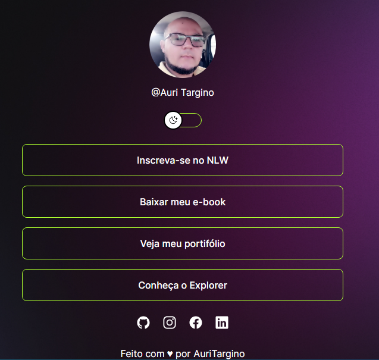

<h1 align="center"> Projeto Agregador de links para usar como cartão de visitas </h1>

Esse projeto foi um curso que fiz pela Rocketseat, para ensino de tecnologias WEB, portanto mudei algumas coisas para não dar aquela sensação de copiar colar,
outro detalhe, é que o projeto é para quem já tem um pouco de experiência com html, css, js, pois, quem não tem, creio que não entende muita coisa, muito rápido bem resumido, mas... para quem ja conhece uma pouco, agrega mais conhecimento, isso que é importante. 

  <a href="#-tecnologias">Tecnologias</a>&nbsp;&nbsp;&nbsp;|&nbsp;&nbsp;&nbsp;
  <a href="#-projeto">Projeto</a>&nbsp;&nbsp;&nbsp;|&nbsp;&nbsp;&nbsp;
  <a href="#-layout">Layout</a>&nbsp;&nbsp;&nbsp;|&nbsp;&nbsp;&nbsp;
  <a href="#memo-licença">Licença</a>

  

 

  

<a href="https://auritargino.github.io/projeto-chave-mudan-a-button/"> Abrir projeto  </a> 

## 🚀 Tecnologias

Esse projeto foi desenvolvido com as seguintes tecnologias:

- HTML e CSS
- JavaScript
- Git e Github
- Figma
- Readme
## 💻 Projeto

O DevLinks é um agregador de links para usar como cartão de visitas online.

## 🔖 Layout

Você pode visualizar o layout do projeto através [DESSE LINK](https://www.figma.com/community/file/1187422022288947321). É necessário ter conta no [Figma](https://figma.com) para acessá-lo.

## :memo: Licença

Esse projeto está sob a licença MIT.
---
Feito com ♥ por  Auri Targino : ( https://github.com/AuriTargino/projeto-chave-mudan-a-button)