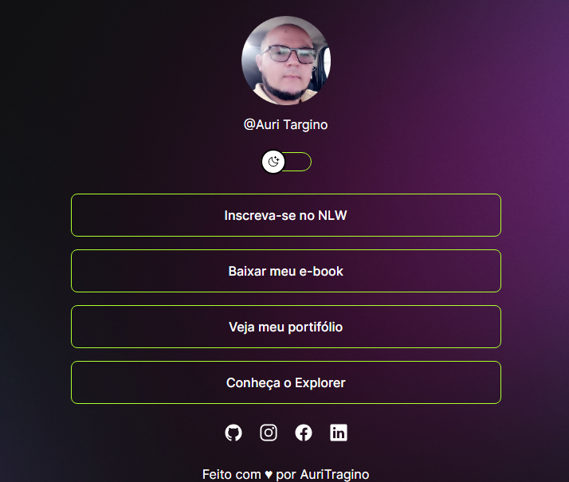

<h1 align="center"> Projeto Auri Targino </h1>

Programa exclusivo e gratuito, promovido pela Rocketseat para ensino de tecnologias WEB. portanto mudei algumas coisas para não dar aquela sensação de copiar colar,
outro detalhe, é que o projeto é para quem já tem um pouco de experiência com html, css, js, pois 
quem não tem, creio que não entende muita coisa, muito rápido bem resumido, mas... o mérito vai para a escola que tem uma grade muito boa, e confesso que vem me ajudando muito, muitas coisas que não aprendi no curso de analista de sistema, estou aprendendo aqui na Rocketseat, meu agradecimento ao professor "Maykbrito".  

  <a href="#-tecnologias">Tecnologias</a>&nbsp;&nbsp;&nbsp;|&nbsp;&nbsp;&nbsp;
  <a href="#-projeto">Projeto</a>&nbsp;&nbsp;&nbsp;|&nbsp;&nbsp;&nbsp;
  <a href="#-layout">Layout</a>&nbsp;&nbsp;&nbsp;|&nbsp;&nbsp;&nbsp;
  <a href="#memo-licença">Licença</a>

  

 

  

## 🚀 Tecnologias

Esse projeto foi desenvolvido com as seguintes tecnologias:

- HTML e CSS
- JavaScript
- Git e Github
- Figma
- Readme
## 💻 Projeto

O DevLinks é um agregador de links para usar como cartão de visitas online.

## :memo: Licença

Esse projeto está sob a licença MIT.
---
Feito com ♥ Auri Targino (https://github.com/AuriTargino)